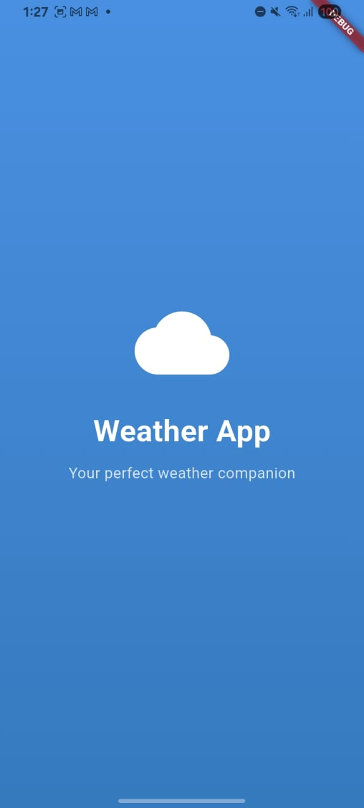
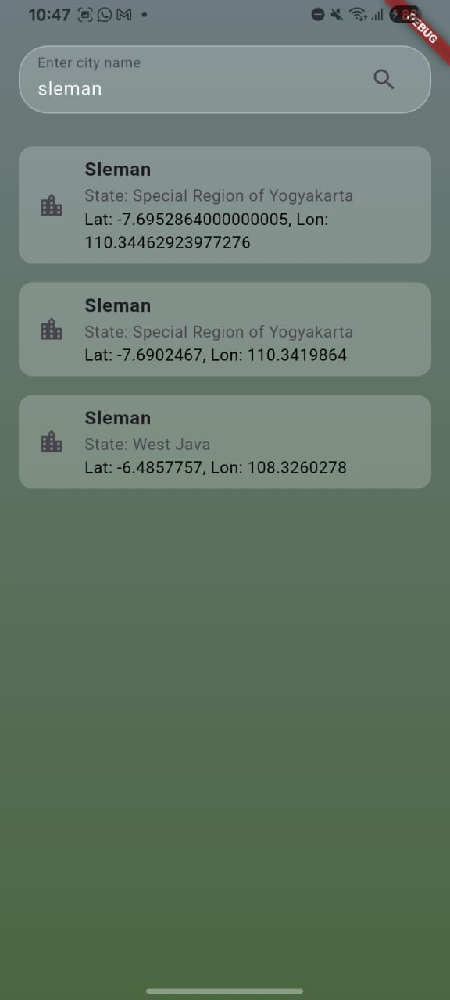
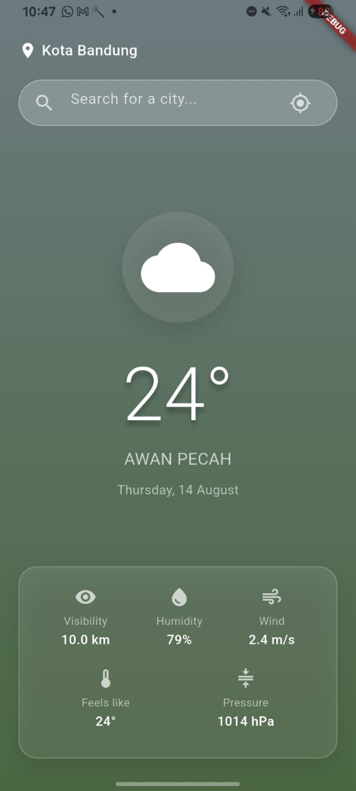

# Weather App

A simple Flutter app that fetches and displays weather information based on device location or user-entered city name using OpenWeatherMap API.

---

## Screenshots

<p>
  
  
  
  

## </p>

## Features

- Fetch current weather based on:
  - **Device location** (via Geolocator and permission handling)
  - **Manual city search** using OpenWeatherMap Geocoding API
- Displays:
  - City name and coordinates
  - Temperature, humidity, wind speed, etc.
  - Weather icon
- Built with **Clean Architecture** principles:
  - Models, Entities, RemoteDatasource, Repository, Providers/Notifier, UI separation
- Features:
  - Debounce for search input
  - Error handling & loading states
  - Clean UI with category tabs and product-style weather cards

---

## Installation

1. Clone this repository:
   ```bash
   git clone https://github.com/rapaccel/weather_app.git
   cd weather_app
   flutter pub get
   ```
